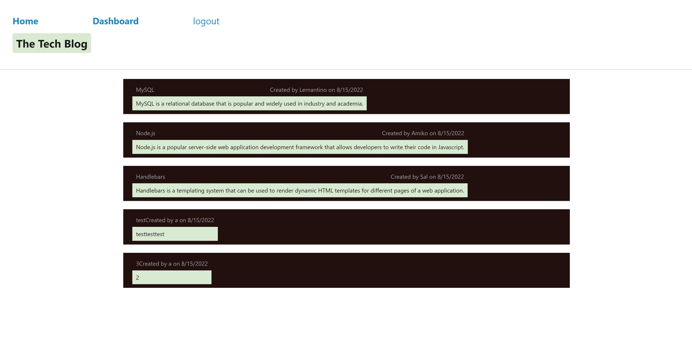

# MVC-Tech-Blog

## Description

This program creates a tech blog, in which a user can create an account, log in and out, then view, create, and delete blog posts, while also adding comments to them. This program uses Handlebars, Express, MySQL, Sequelize, Dotenv, and Bcrypt.

## Installation

Program may be used live on [Heroku](https://desolate-harbor-23002.herokuapp.com/). Alternatively, you may download the [Github repo](https://github.com/rensyphon/MVC-Tech-Blog). After doing so, log into MySQL and run `source schema.sql` in the ./db/ folder to create the database. Then, in the root folder, run `npm seed` to seed the database and `npm start` to begin the program.

## Usage

From the homepage, you may click `login` at the top to login or sign up. After that, you may logout with the `logout` button. Clicking on `dashboard` will take you to a page where you can click to create a new blog post, then edit or delete it subsequently. On the homepage, you may click on existing blog posts, then add comments to them.


    ```md
    
    ```

## Credits

Select code originally created by University of Arizona Full Stack Coding Boot Camp, 2022. https://bootcamp.ce.arizona.edu/coding/